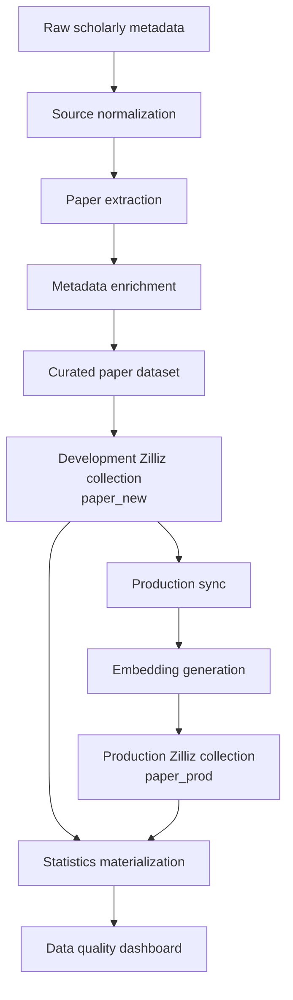
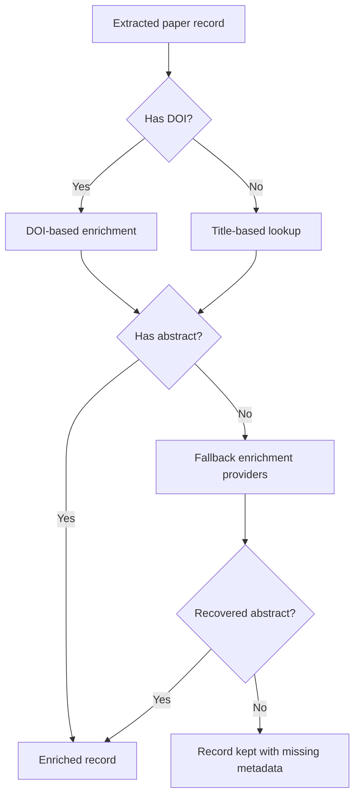
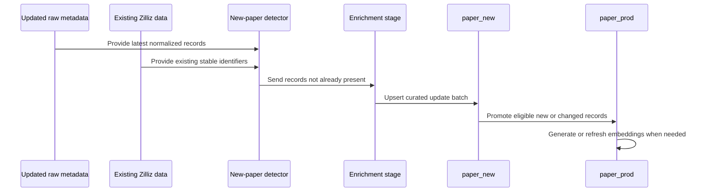
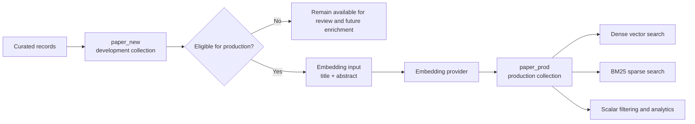
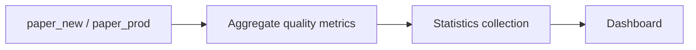

# Vitality2 Dataset

This repository defines the data pipeline for building, enriching, indexing, and updating the Vitality2 paper database. The pipeline starts from scholarly metadata, normalizes papers by Vitality source, enriches missing research metadata, writes the curated data into Zilliz, and promotes eligible records into a production collection with embeddings.

## Pipeline Overview

The pipeline has two main collections:

- `paper_new`: the development collection that receives curated and enriched paper records.
- `paper_prod`: the production collection that contains eligible papers with dense embeddings and searchable metadata.

## Creation Flow

The creation flow is used when the dataset is built from scratch or when a full rebuild is intended.

```mermaid
flowchart LR
    A["Collect raw metadata"] --> B["Select target venues and sources"]
    B --> C["Normalize source names"]
    C --> D["Extract paper records"]
    D --> E["Enrich missing metadata"]
    E --> F["Validate curated records"]
    F --> G["Write to paper_new"]
    G --> H["Promote eligible records"]
    H --> I["Generate embeddings"]
    I --> J["Write to paper_prod"]
    J --> K["Build search and vector indexes"]
```

Conceptually, the creation flow does the following:

1. Collects raw paper metadata from external scholarly sources.
2. Maps raw venue names into the Vitality source taxonomy.
3. Extracts paper records with stable identifiers, authors, source metadata, publication year, DOI, and full-paper status.
4. Enriches records with abstracts, keywords, and citation counts.
5. Writes the curated dataset into `paper_new`.
6. Selects production-eligible records, currently requiring core fields such as DOI, title, and abstract.
7. Generates dense embeddings from the configured embedding input fields.
8. Upserts production records into `paper_prod`.
9. Builds vector and keyword-search indexes for retrieval.

## Enrichment Flow

Raw bibliographic data is incomplete for search and recommendation use cases, so the enrichment stage fills in research metadata from multiple providers.

The enriched dataset keeps both complete and incomplete records. Complete records are preferred for production embedding and retrieval. Records that still miss abstracts remain useful for metadata browsing, quality reports, and future enrichment retries.

## Update Flow

The update flow is incremental. It avoids rebuilding or re-embedding unchanged records by comparing incoming paper records against existing stable identifiers.

The update flow uses a stable paper key as the baseline for detecting new records. This is important because a record's preferred public identifier may improve over time, for example when a DOI becomes available later.

Production sync classifies each candidate record before writing:

- New record: generate an embedding and upsert the full production row.
- Embedding-input change: regenerate the embedding and upsert the full production row.
- Metadata-only change: update scalar metadata while preserving the existing embedding.
- Unchanged record: skip.
- Embedding failure: keep the row with `has_embedding = false` so it can be retried later.

## Zilliz Data Model

`paper_new` is the staging and review collection. It is designed to hold the broad curated dataset, including records that may still miss optional metadata.

`paper_prod` is the retrieval-ready collection. It stores production-eligible records, dense embeddings, the logical embedding model identifier, a boolean marker for embedding availability, BM25 sparse-search fields, and scalar metadata for filtering.

## `paper_prod` Schema

`paper_prod` uses a fixed schema with dynamic fields disabled. The primary key is `paper_uid`.

| Field | Type | Nullable | Purpose |
| --- | --- | --- | --- |
| `paper_uid` | `VARCHAR(1024)` | No | Stable primary identifier for the paper. |
| `dblp_key` | `VARCHAR(1024)` | Yes | Source-specific stable bibliographic key when available. |
| `doi` | `VARCHAR(512)` | Yes | DOI used for linking, deduplication, and eligibility checks. |
| `embedding` | `FLOAT_VECTOR(1536)` | Yes | Dense semantic embedding for vector retrieval. |
| `embedding_model` | `VARCHAR(256)` | Yes | Logical embedding model used to create `embedding`. |
| `has_embedding` | `BOOL` | No | Searchable marker showing whether a dense embedding was successfully written. |
| `umap` | `JSON` | Yes | Optional projection coordinates or visualization metadata. |
| `search_text` | `VARCHAR(65535)` | Yes | Analyzer-enabled text used for keyword search. |
| `search_sparse` | `SPARSE_FLOAT_VECTOR` | No | BM25 sparse vector generated from `search_text`. |
| `title` | `VARCHAR(4096)` | No | Paper title. |
| `abstract` | `VARCHAR(65535)` | Yes | Paper abstract used for search and embedding input. |
| `authors` | `ARRAY<VARCHAR(512)>` | No | Ordered author list. |
| `keywords` | `ARRAY<VARCHAR(512)>` | Yes | Enriched keywords or topic labels. |
| `source` | `VARCHAR(1024)` | No | Normalized Vitality source name. |
| `dblp_source` | `VARCHAR(1024)` | No | Original or mapped bibliographic source name. |
| `year` | `INT64` | No | Publication year. |
| `citation_count` | `INT64` | Yes | Enriched citation count. |
| `full_paper` | `BOOL` | No | Whether the record represents a full paper. |

Indexes:

- `embedding`: dense vector index using cosine similarity.
- `search_sparse`: sparse inverted index for BM25 keyword retrieval.

The BM25 sparse vector is produced from `search_text`. Dense embedding availability is tracked with `has_embedding` because vector-null filtering is not a reliable operational filter.

## Statistics and Dashboard

Statistics are materialized from the paper collections into a separate statistics collection. These statistics support quality checks such as paper counts, missing DOI counts, missing abstract counts, complete-record counts, and source/year breakdowns.

The dashboard is intended for observing dataset coverage and quality after creation, enrichment, updates, and production sync.
