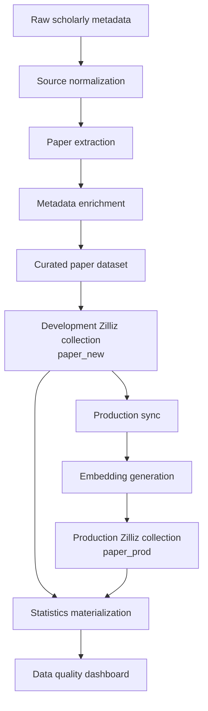
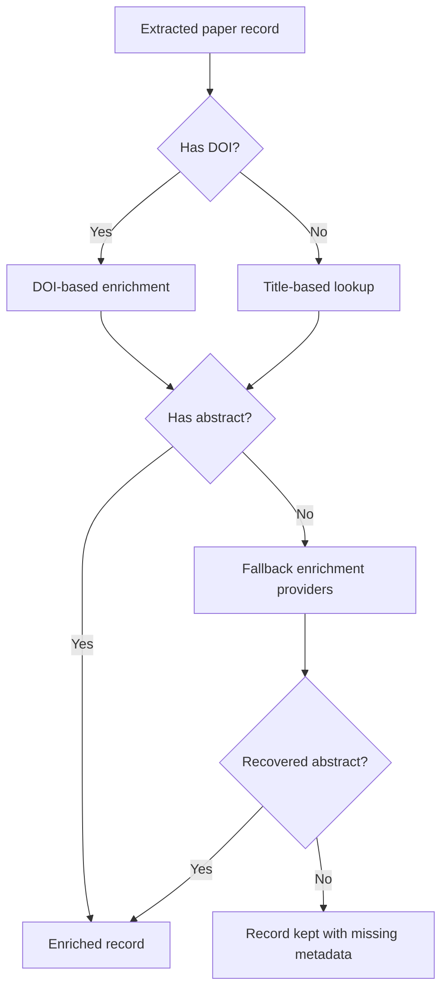
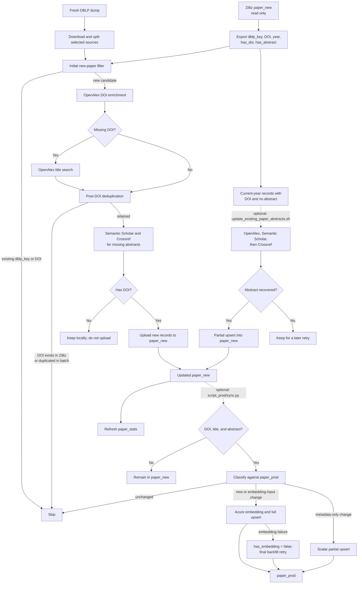
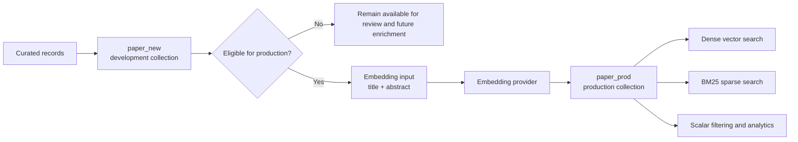
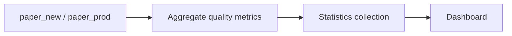

# Vitality2 Dataset

This repository defines the data pipeline for building, enriching, indexing, and updating the Vitality2 paper database. The pipeline starts from scholarly metadata, normalizes papers by Vitality source, enriches missing research metadata, writes the curated data into Zilliz, and promotes eligible records into a production collection with embeddings.

## Setup

Install the dependencies for the DBLP, enrichment, and `paper_new` update scripts:

Linux/macOS:
```bash
python3 -m venv .venv
source .venv/bin/activate
python3 -m pip install -r requirements.txt
python3 -m pip install -r script_prod/requirements.txt
cp .env.example .env
```

The update and production-sync scripts require these Zilliz Cloud credentials. Set them in the shell or in the repository `.env` file:

```bash
ZILLIZ_URI=...
ZILLIZ_TOKEN=...
```

Optional enrichment settings:

- `OPENALEX_API_KEY` or `OPENALEX_API_KEY1` through `OPENALEX_API_KEY6`.
- `SEMANTIC_SCHOLAR_API_KEY` or `S2_API_KEY`.
- `CROSSREF_MAILTO`.

Production sync also requires Azure OpenAI embedding settings:

```bash
AZURE_OPENAI_ENDPOINT=...
AZURE_OPENAI_API_KEY=...
AZURE_OPENAI_EMBED_DEPLOYMENT=...
AZURE_OPENAI_EMBED_API_VERSION=...
```

`AZURE_OPENAI_EMBED_DEPLOYMENT` is the Azure deployment name used for API calls. It may be a comma-separated list for round-robin use. The logical model name written into `paper_prod.embedding_model` is configured separately in `script_prod/config.toml`.

## Pipeline Overview


```mermaid
flowchart TD
    A["Raw scholarly metadata"] --> B["Source normalization"]
    B --> C["Paper extraction"]
    C --> D["Metadata enrichment"]
    D --> E["Curated paper dataset"]
    E --> F["Development Zilliz collection<br/>paper_new"]
    F --> G["Production sync"]
    G --> H["Embedding generation"]
    H --> I["Production Zilliz collection<br/>paper_prod"]
    F --> J["Statistics materialization"]
    I --> J
    J --> K["Data quality dashboard"]
```

The pipeline has two main collections:

- `paper_new`: the development collection that receives curated and enriched paper records.
- `paper_prod`: the production collection that contains eligible papers with dense embeddings and searchable metadata.

## Creation Flow

The creation flow is used when the dataset is built from scratch or when a full rebuild is intended.


```mermaid
flowchart LR
    A["Collect raw metadata"] --> B["Select target venues and sources"]
    B --> C["Normalize source names"]
    C --> D["Extract paper records"]
    D --> E["Enrich missing metadata"]
    E --> F["Validate curated records"]
    F --> G["Write to paper_new"]
    G --> H["Promote eligible records"]
    H --> I["Generate embeddings"]
    I --> J["Write to paper_prod"]
    J --> K["Build search and vector indexes"]
```

Conceptually, the creation flow does the following:

1. Collects raw paper metadata from external scholarly sources.
2. Maps raw venue names into the Vitality source taxonomy.
3. Extracts paper records with stable identifiers, authors, source metadata, publication year, DOI, and full-paper status.
4. Enriches records with abstracts, keywords, and citation counts.
5. Writes the curated dataset into `paper_new`.
6. Selects production-eligible records, currently requiring core fields such as DOI, title, and abstract.
7. Generates dense embeddings from the configured embedding input fields.
8. Upserts production records into `paper_prod`.
9. Builds vector and keyword-search indexes for retrieval.

## Enrichment Flow

Raw bibliographic data is incomplete for search and recommendation use cases, so the enrichment stage fills in research metadata from multiple providers.


```mermaid
flowchart TD
    A["Extracted paper record"] --> B{"Has DOI?"}
    B -- "Yes" --> C["DOI-based enrichment"]
    B -- "No" --> D["Title-based lookup"]
    C --> E{"Has abstract?"}
    D --> E
    E -- "No" --> F["Fallback enrichment providers"]
    E -- "Yes" --> G["Enriched record"]
    F --> H{"Recovered abstract?"}
    H -- "Yes" --> G
    H -- "No" --> I["Record kept with missing metadata"]
```

The enriched dataset keeps both complete and incomplete records. Complete records are preferred for production embedding and retrieval. Records that still miss abstracts remain useful for metadata browsing, quality reports, and future enrichment retries.

## Update Flow

The update flow has a main incremental DBLP path and an optional backfill path for existing Zilliz records that have DOI but no abstract. Both paths use the same Zilliz credential configuration described in [Setup](#setup).


```mermaid
flowchart TD
    A["Fresh DBLP dump"] --> B["Download and split selected sources"]
    Existing["Zilliz paper_new<br/>read only"] --> C["Export dblp_key, DOI, year,<br/>has_doi, has_abstract"]
    B --> D["Initial new-paper filter"]
    C --> D
    D -->|"existing dblp_key or DOI"| X["Skip"]
    D -->|"new candidate"| E["OpenAlex DOI enrichment"]
    E --> F{"Missing DOI?"}
    F -->|"Yes"| G["OpenAlex title search"]
    F -->|"No"| H["Post-DOI deduplication"]
    G --> H
    H -->|"DOI exists in Zilliz<br/>or duplicated in batch"| X
    H -->|"retained"| I["Semantic Scholar and Crossref<br/>for missing abstracts"]
    I --> J{"Has DOI?"}
    J -->|"No"| K["Keep locally; do not upload"]
    J -->|"Yes"| L["Upload new records to paper_new"]

    C --> N["Current-year records with<br/>DOI and no abstract"]
    N -. "optional: update_existing_paper_abstracts.sh" .-> O["OpenAlex, Semantic Scholar,<br/>then Crossref"]
    O --> P{"Abstract recovered?"}
    P -->|"Yes"| Q["Partial upsert into paper_new"]
    P -->|"No"| R["Keep for a later retry"]

    L --> Updated["Updated paper_new"]
    Q --> Updated
    Updated --> M["Refresh paper_stats"]
    Updated -. "optional: script_prod/sync.py" .-> S{"DOI, title, and abstract?"}
    S -->|"No"| T["Remain in paper_new"]
    S -->|"Yes"| U["Classify against paper_prod"]
    U -->|"unchanged"| X
    U -->|"new or embedding-input change"| V["Azure embedding and full upsert"]
    U -->|"metadata-only change"| W["Scalar partial upsert"]
    V --> Y["paper_prod"]
    W --> Y
    V -->|"embedding failure"| Z["has_embedding = false;<br/>final backfill retry"]
    Z --> Y
```

The main script is `script/update_paper_pipeline.sh`. It writes new-paper work under `data/papers/updateYYYYMMDD/` and prepares optional existing-paper candidates under `data/papers/update_missingYYYYMMDD/`.

### Main Incremental Update

Run the complete main workflow:

```bash
bash script/update_paper_pipeline.sh
```

If the DBLP dump has already been downloaded and split, resume from Zilliz export and filtering:

```bash
DOWNLOAD_DBLP=0 \
SPLIT_DBLP=0 \
bash script/update_paper_pipeline.sh
```

To run the update logic without writing new records or statistics to Zilliz:

```bash
RUN_UPLOAD=0 \
RUN_STATS=0 \
bash script/update_paper_pipeline.sh
```

The main path works as follows:

1. Downloads and splits DBLP when enabled.
2. Reads `paper_new` and exports only `paper_uid`, `dblp_key`, `doi`, `year`, `has_doi`, and `has_abstract`.
3. Excludes records whose normalized title exactly matches a line in `data/dblp/exclude_title.txt`, then treats a DBLP record as already present when either its `dblp_key` or DOI exists in `paper_new`.
4. Sends initially new records through OpenAlex DOI enrichment. Records without DOI are then searched by title in OpenAlex.
5. Rechecks every recovered DOI against Zilliz and collapses duplicate DOI values within the update batch. When two batch records have the same DOI, an enriched record is preferred over one still missing an abstract.
6. Uses Semantic Scholar and Crossref only for retained DOI records still missing abstracts.
7. Uploads only retained records with DOI to `paper_new`. Records still without DOI remain in the local update directory and are skipped by the upload command.
8. Rebuilds `paper_stats` only after a new-paper upload.

Semantic Scholar and Crossref failures are non-fatal: affected records remain in `missing/`, while the rest of the update flow continues.

Useful controls for the main script:

| Variable | Default | Effect |
| --- | --- | --- |
| `UPDATE_DATE` | Current date | Date suffix used for update directories. |
| `UPDATE_DIR` | `data/papers/updateYYYYMMDD` | New-paper update batch directory. |
| `EXISTING_UPDATE_DIR` | `data/papers/update_missingYYYYMMDD` | Optional old-paper candidate and backfill directory. |
| `EXISTING_UPDATE_YEAR` | Current year | Limits prepared old-paper candidates to one publication year. |
| `DOWNLOAD_DBLP`, `SPLIT_DBLP` | `1` | Enable DBLP download and source splitting. |
| `RUN_ENRICH`, `RUN_POST_DOI_DEDUP` | `1` | Enable metadata enrichment and recovered-DOI deduplication. |
| `RUN_UPLOAD`, `RUN_STATS` | `1` | Enable Zilliz new-paper upload and statistics refresh. |
| `PYTHON_BIN` | `python3` | Python interpreter used by the shell scripts. |

### Existing Paper Abstract Backfill (Optional)

The main script only prepares this path; it does not modify existing papers. Run `script/update_existing_paper_abstracts.sh` when the prepared records should be retried. By default, it processes `data/papers/update_missingYYYYMMDD/` for the current date, containing current-year `paper_new` records with DOI but no abstract.

```bash
bash script/update_existing_paper_abstracts.sh
```

This optional script runs DOI-based enrichment in this order:

1. OpenAlex by DOI.
2. Semantic Scholar for records still missing abstracts.
3. Crossref for records still missing abstracts.

Only old records that receive an abstract are partial-upserted back into `paper_new`. The partial update writes `doi`, `abstract`, `search_text`, `has_doi`, `has_abstract`, and recovered `keywords` or `citation_count`; it preserves existing embeddings, UMAP values, title, authors, source, and year. The script refreshes `paper_stats` by default after a successful run. Set `RUN_EXISTING_ENRICH=0`, `RUN_EXISTING_UPSERT=0`, or `RUN_STATS=0` to disable its corresponding stage.

### Production Sync (Optional)

Run `script_prod/sync.py` after the main update and, when applicable, after the optional abstract backfill. It creates `paper_prod` if necessary, then streams eligible `paper_new` records in batches. The script asks for confirmation before processing and before each batch unless "all" is selected.

```bash
python3 script_prod/sync.py
```

Non-secret settings live in `script_prod/config.toml`. By default, production eligibility requires non-empty `doi`, `title`, and `abstract`; dense embedding input is `title` plus `abstract`; and production rows are written to `paper_prod`.

Production sync classifies each candidate record before writing:

- New record: generate an embedding and upsert the full production row.
- Embedding-input change: regenerate the embedding and upsert the full production row.
- Metadata-only change: update scalar metadata while preserving the existing embedding.
- Unchanged record: skip.
- Embedding failure: upsert the scalar row with `has_embedding = false`, then make a final backfill attempt for records still missing embeddings.

## Zilliz Data Model


```mermaid
flowchart LR
    A["Curated records"] --> B["paper_new<br/>development collection"]
    B --> C{"Eligible for production?"}
    C -- "No" --> D["Remain available for review and future enrichment"]
    C -- "Yes" --> E["Embedding input<br/>title + abstract"]
    E --> F["Embedding provider"]
    F --> G["paper_prod<br/>production collection"]
    G --> H["Dense vector search"]
    G --> I["BM25 sparse search"]
    G --> J["Scalar filtering and analytics"]
```

`paper_new` is the staging and review collection. It is designed to hold the broad curated dataset, including records that may still miss optional metadata.

`paper_prod` is the retrieval-ready collection. It stores production-eligible records, dense embeddings, the logical embedding model identifier, a boolean marker for embedding availability, BM25 sparse-search fields, and scalar metadata for filtering.

## `paper_prod` Schema

`paper_prod` uses a fixed schema with dynamic fields disabled. The primary key is `paper_uid`.

| Field | Type | Nullable | Purpose |
| --- | --- | --- | --- |
| `paper_uid` | `VARCHAR(1024)` | No | Stable primary identifier for the paper. |
| `dblp_key` | `VARCHAR(1024)` | Yes | Source-specific stable bibliographic key when available. |
| `doi` | `VARCHAR(512)` | Yes | DOI used for linking, deduplication, and eligibility checks. |
| `embedding` | `FLOAT_VECTOR(1536)` | Yes | Dense semantic embedding for vector retrieval. |
| `embedding_model` | `VARCHAR(256)` | Yes | Logical embedding model used to create `embedding`. |
| `has_embedding` | `BOOL` | No | Searchable marker showing whether a dense embedding was successfully written. |
| `umap` | `JSON` | Yes | Optional projection coordinates or visualization metadata. |
| `search_text` | `VARCHAR(65535)` | Yes | Analyzer-enabled text used for keyword search. |
| `search_sparse` | `SPARSE_FLOAT_VECTOR` | No | BM25 sparse vector generated from `search_text`. |
| `title` | `VARCHAR(4096)` | No | Paper title. |
| `abstract` | `VARCHAR(65535)` | Yes | Paper abstract used for search and embedding input. |
| `authors` | `ARRAY<VARCHAR(512)>` | No | Ordered author list. |
| `keywords` | `ARRAY<VARCHAR(512)>` | Yes | Enriched keywords or topic labels. |
| `source` | `VARCHAR(1024)` | No | Normalized Vitality source name. |
| `dblp_source` | `VARCHAR(1024)` | No | Original or mapped bibliographic source name. |
| `year` | `INT64` | No | Publication year. |
| `citation_count` | `INT64` | Yes | Enriched citation count. |
| `full_paper` | `BOOL` | No | Whether the record represents a full paper. |

Indexes:

- `embedding`: dense vector index using cosine similarity.
- `search_sparse`: sparse inverted index for BM25 keyword retrieval.

The BM25 sparse vector is produced from `search_text`. Dense embedding availability is tracked with `has_embedding` because vector-null filtering is not a reliable operational filter.

## Statistics and Dashboard

Statistics are materialized from the paper collections into a separate statistics collection. These statistics support quality checks such as paper counts, missing DOI counts, missing abstract counts, complete-record counts, and source/year breakdowns.


```mermaid
flowchart LR
    A["paper_new / paper_prod"] --> B["Aggregate quality metrics"]
    B --> C["Statistics collection"]
    C --> D["Dashboard"]
```

The dashboard is intended for observing dataset coverage and quality after creation, enrichment, updates, and production sync.
