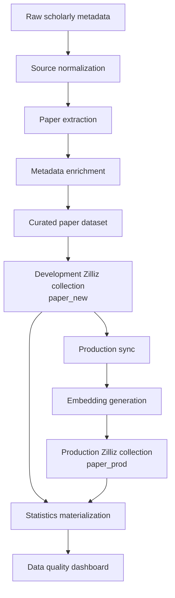
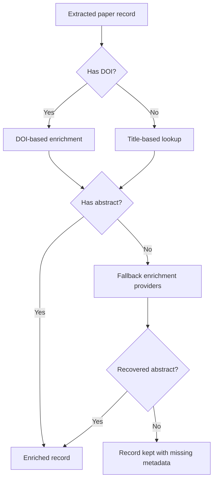
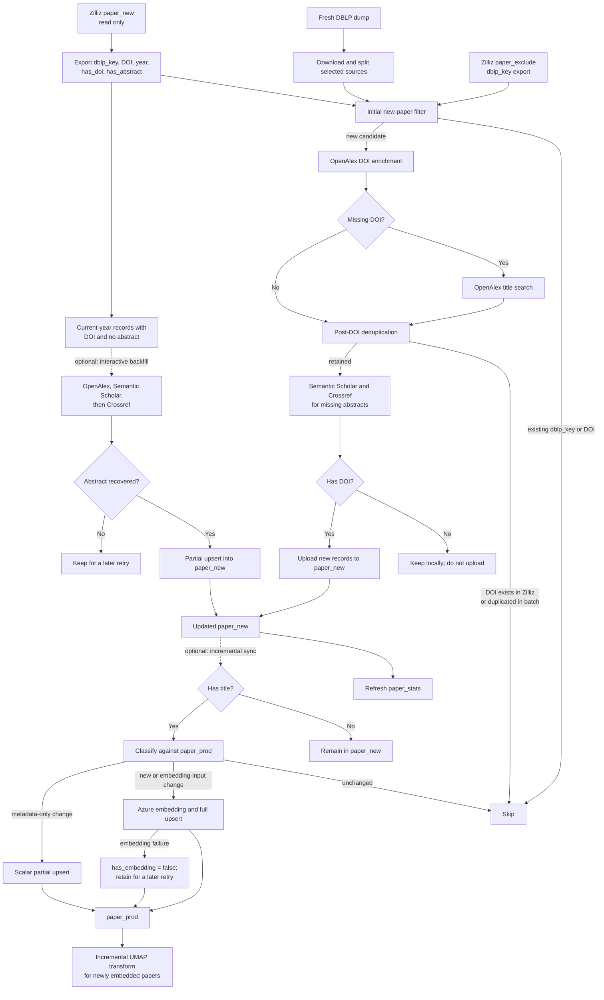
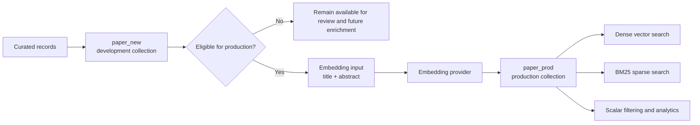
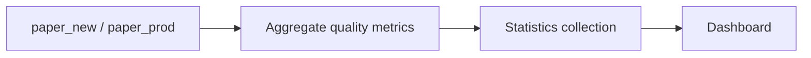

# Vitality2 Dataset

This repository defines the data pipeline for building, enriching, indexing, and updating the Vitality2 paper database. The pipeline starts from scholarly metadata, normalizes papers by Vitality source, enriches missing research metadata, writes the curated data into Zilliz, and promotes eligible records into a production collection with embeddings.

## Setup

Install the dependencies for the DBLP, enrichment, and `paper_new` update scripts:

Linux/macOS:
```bash
python3 -m venv .venv
source .venv/bin/activate
python3 -m pip install -r requirements.txt
python3 -m pip install -r script_prod/requirements.txt
cp .env.example .env
```

The update and production-sync scripts require these Zilliz Cloud credentials. Set them in the shell or in the repository `.env` file:

```bash
ZILLIZ_URI=...
ZILLIZ_TOKEN=...
```

Optional enrichment settings:

- `OPENALEX_API_KEY` or `OPENALEX_API_KEY1` through `OPENALEX_API_KEY6`.
- `SEMANTIC_SCHOLAR_API_KEY` or `S2_API_KEY`.
- `CROSSREF_MAILTO`.

Production sync also requires Azure OpenAI embedding settings:

```bash
AZURE_OPENAI_ENDPOINT=...
AZURE_OPENAI_API_KEY=...
AZURE_OPENAI_EMBED_DEPLOYMENT=...
AZURE_OPENAI_EMBED_API_VERSION=...
```

`AZURE_OPENAI_EMBED_DEPLOYMENT` is the Azure deployment name used for API calls. It may be a comma-separated list for round-robin use. The logical model name written into `paper_prod.embedding_model` is configured separately in `script_prod/config.toml`.

## Pipeline Overview


```mermaid
flowchart TD
    A["Raw scholarly metadata"] --> B["Source normalization"]
    B --> C["Paper extraction"]
    C --> D["Metadata enrichment"]
    D --> E["Curated paper dataset"]
    E --> F["Development Zilliz collection<br/>paper_new"]
    F --> G["Production sync"]
    G --> H["Embedding generation"]
    H --> I["Production Zilliz collection<br/>paper_prod"]
    F --> J["Statistics materialization"]
    I --> J
    J --> K["Data quality dashboard"]
```

The pipeline has two main collections:

- `paper_new`: the development collection that receives curated and enriched paper records.
- `paper_prod`: the production collection that contains eligible papers with dense embeddings and searchable metadata.

## Creation Flow

The creation flow is used when the dataset is built from scratch or when a full rebuild is intended.


```mermaid
flowchart LR
    A["Collect raw metadata"] --> B["Select target venues and sources"]
    B --> C["Normalize source names"]
    C --> D["Extract paper records"]
    D --> E["Enrich missing metadata"]
    E --> F["Validate curated records"]
    F --> G["Write to paper_new"]
    G --> H["Promote eligible records"]
    H --> I["Generate embeddings"]
    I --> J["Write to paper_prod"]
    J --> K["Build search and vector indexes"]
```

Conceptually, the creation flow does the following:

1. Collects raw paper metadata from external scholarly sources.
2. Maps raw venue names into the Vitality source taxonomy.
3. Extracts paper records with stable identifiers, authors, source metadata, publication year, DOI, and full-paper status.
4. Enriches records with abstracts, keywords, and citation counts.
5. Writes the curated dataset into `paper_new`.
6. Selects production-eligible records with a title; DOI and abstract are optional.
7. Generates dense embeddings from the configured embedding input fields.
8. Upserts production records into `paper_prod`.
9. Builds vector and keyword-search indexes for retrieval.

## Enrichment Flow

Raw bibliographic data is incomplete for search and recommendation use cases, so the enrichment stage fills in research metadata from multiple providers.


```mermaid
flowchart TD
    A["Extracted paper record"] --> B{"Has DOI?"}
    B -- "Yes" --> C["DOI-based enrichment"]
    B -- "No" --> D["Title-based lookup"]
    C --> E{"Has abstract?"}
    D --> E
    E -- "No" --> F["Fallback enrichment providers"]
    E -- "Yes" --> G["Enriched record"]
    F --> H{"Recovered abstract?"}
    H -- "Yes" --> G
    H -- "No" --> I["Record kept with missing metadata"]
```

The enriched dataset keeps both complete and incomplete records. Complete records are preferred for production embedding and retrieval. Records that still miss abstracts remain useful for metadata browsing, quality reports, and future enrichment retries.

## Update Flow

The update flow has a main incremental DBLP path and an optional backfill path for existing Zilliz records that have DOI but no abstract. Both paths use the same Zilliz credential configuration described in [Setup](#setup).


```mermaid
flowchart TD
    A["Fresh DBLP dump"] --> B["Download and split selected sources"]
    Existing["Zilliz paper_new<br/>read only"] --> C["Export dblp_key, DOI, year,<br/>has_doi, has_abstract"]
    Exclude["Zilliz paper_exclude<br/>dblp_key export"] --> D
    B --> D["Initial new-paper filter"]
    C --> D
    D -->|"existing dblp_key or DOI"| X["Skip"]
    D -->|"new candidate"| E["OpenAlex DOI enrichment"]
    E --> F{"Missing DOI?"}
    F -->|"Yes"| G["OpenAlex title search"]
    F -->|"No"| H["Post-DOI deduplication"]
    G --> H
    H -->|"DOI exists in Zilliz<br/>or duplicated in batch"| X
    H -->|"retained"| I["Semantic Scholar and Crossref<br/>for missing abstracts"]
    I --> J{"Has DOI?"}
    J -->|"No"| K["Keep locally; do not upload"]
    J -->|"Yes"| L["Upload new records to paper_new"]

    C --> N["Current-year records with<br/>DOI and no abstract"]
    N -. "optional: interactive backfill" .-> O["OpenAlex, Semantic Scholar,<br/>then Crossref"]
    O --> P{"Abstract recovered?"}
    P -->|"Yes"| Q["Partial upsert into paper_new"]
    P -->|"No"| R["Keep for a later retry"]

    L --> Updated["Updated paper_new"]
    Q --> Updated
    Updated --> M["Refresh paper_stats"]
    Updated -. "optional: incremental sync" .-> S{"Has title?"}
    S -->|"No"| T["Remain in paper_new"]
    S -->|"Yes"| U["Classify against paper_prod"]
    U -->|"unchanged"| X
    U -->|"new or embedding-input change"| V["Azure embedding and full upsert"]
    U -->|"metadata-only change"| W["Scalar partial upsert"]
    V --> Y["paper_prod"]
    W --> Y
    V -->|"embedding failure"| Z["has_embedding = false;<br/>retain for a later retry"]
    Z --> Y
    Y --> AA["Incremental UMAP transform<br/>for newly embedded papers"]
```

The only update entry point is `script/update_papers.py`. It runs the DBLP, enrichment, Zilliz, production, and UMAP stages in one Python process.

```bash
python3 script/update_papers.py
```

Use `--no-write` to run only local processing and Zilliz read-only exports. Use `--yes` for non-interactive execution.

```bash
python3 script/update_papers.py --no-write
python3 script/update_papers.py --yes
```

### Requirements

- `ZILLIZ_URI` and `ZILLIZ_TOKEN` are required for Zilliz reads and writes.
- `data/dblp/dump/dblp.xml`, `data/dblp/dump/dblp.dtd`, and `data/dblp/source_mapping.csv` are required when DBLP download is skipped.
- `paper_exclude` must exist in Zilliz and contain `dblp_key` values. Step 2 exports them to `data/zilliz/paper_exclude_dblp_keys.txt` for step 3 filtering.
- OpenAlex credentials are required when new-paper enrichment runs. Semantic Scholar and Crossref credentials are optional but used when their stages are selected.
- Production sync requires `AZURE_OPENAI_ENDPOINT`, `AZURE_OPENAI_API_KEY`, `AZURE_OPENAI_EMBED_DEPLOYMENT`, and `AZURE_OPENAI_EMBED_API_VERSION`. A title is sufficient for production; abstract and DOI may be empty.
- Step 9 requires `data/zilliz/umap/paper_prod_umap.joblib`. It loads this existing model and skips UMAP when the file is absent; it never fits a new model.

### Behavior

1. Step 1 downloads DBLP and rebuilds selected-source split files when selected.
2. Step 2 exports `paper_new` metadata (`paper_uid`, `dblp_key`, `doi`, `year`, `has_doi`, `has_abstract`) and all `paper_exclude.dblp_key` values. It also prepares current-year, DOI/no-abstract existing-paper candidates.
3. Step 3 removes excluded DBLP keys and papers already present in `paper_new` by DBLP key or DOI.
4. Step 4 runs OpenAlex DOI enrichment, OpenAlex title search for missing DOI, DOI deduplication, then optional Semantic Scholar and Crossref abstract recovery. Semantic Scholar and Crossref failures are non-fatal.
5. Step 5 uploads only records with DOI to `paper_new`; no-DOI records stay in `data/papers/updateYYYYMMDD/`.
6. Step 6 optionally enriches and partial-upserts current-year existing papers with DOI but no abstract.
7. Step 7 refreshes `paper_stats` only after a `paper_new` write.
8. Step 8 syncs `paper_prod`: changed UIDs only after a write, or all title-eligible `paper_new` rows when no write occurred and the user confirms. It classifies rows as new, embedding-input change, metadata-only change, or unchanged before writing.
9. Step 9 transforms only the UIDs successfully embedded or re-embedded in step 8, then partial-upserts their UMAP coordinates. Metadata-only updates preserve the existing production UMAP value.

New-paper output is under `data/papers/updateYYYYMMDD/`; existing-paper candidates are under `data/papers/update_missingYYYYMMDD/`. The final run summary is `data/papers/updateYYYYMMDD/update_cli_manifest.json`.

Every prompt accepts `yes/skip`. Skipping step 2 or 3 is allowed only when the corresponding dated local output and Zilliz cache files already exist; the CLI stops rather than continue with a missing cache.

## Zilliz Data Model


```mermaid
flowchart LR
    A["Curated records"] --> B["paper_new<br/>development collection"]
    B --> C{"Eligible for production?"}
    C -- "No" --> D["Remain available for review and future enrichment"]
    C -- "Yes" --> E["Embedding input<br/>title + abstract"]
    E --> F["Embedding provider"]
    F --> G["paper_prod<br/>production collection"]
    G --> H["Dense vector search"]
    G --> I["BM25 sparse search"]
    G --> J["Scalar filtering and analytics"]
```

`paper_new` is the staging and review collection. It is designed to hold the broad curated dataset, including records that may still miss optional metadata.

`paper_prod` is the retrieval-ready collection. It stores production-eligible records, dense embeddings, the logical embedding model identifier, a boolean marker for embedding availability, BM25 sparse-search fields, and scalar metadata for filtering.

## `paper_prod` Schema

`paper_prod` uses a fixed schema with dynamic fields disabled. The primary key is `paper_uid`.

| Field | Type | Nullable | Purpose |
| --- | --- | --- | --- |
| `paper_uid` | `VARCHAR(1024)` | No | Stable primary identifier for the paper. |
| `dblp_key` | `VARCHAR(1024)` | Yes | Source-specific stable bibliographic key when available. |
| `doi` | `VARCHAR(512)` | Yes | DOI used for linking, deduplication, and eligibility checks. |
| `embedding` | `FLOAT_VECTOR(1536)` | Yes | Dense semantic embedding for vector retrieval. |
| `embedding_model` | `VARCHAR(256)` | Yes | Logical embedding model used to create `embedding`. |
| `has_embedding` | `BOOL` | No | Searchable marker showing whether a dense embedding was successfully written. |
| `umap` | `JSON` | Yes | Optional projection coordinates or visualization metadata. |
| `search_text` | `VARCHAR(65535)` | Yes | Analyzer-enabled text used for keyword search. |
| `search_sparse` | `SPARSE_FLOAT_VECTOR` | No | BM25 sparse vector generated from `search_text`. |
| `title` | `VARCHAR(4096)` | No | Paper title. |
| `abstract` | `VARCHAR(65535)` | Yes | Paper abstract used for search and embedding input. |
| `authors` | `ARRAY<VARCHAR(512)>` | No | Ordered author list. |
| `keywords` | `ARRAY<VARCHAR(512)>` | Yes | Enriched keywords or topic labels. |
| `source` | `VARCHAR(1024)` | No | Normalized Vitality source name. |
| `dblp_source` | `VARCHAR(1024)` | No | Original or mapped bibliographic source name. |
| `year` | `INT64` | No | Publication year. |
| `citation_count` | `INT64` | Yes | Enriched citation count. |
| `full_paper` | `BOOL` | No | Whether the record represents a full paper. |

Indexes:

- `embedding`: dense vector index using cosine similarity.
- `search_sparse`: sparse inverted index for BM25 keyword retrieval.

The BM25 sparse vector is produced from `search_text`. Dense embedding availability is tracked with `has_embedding` because vector-null filtering is not a reliable operational filter.

## Statistics and Dashboard

Statistics are materialized from the paper collections into a separate statistics collection. These statistics support quality checks such as paper counts, missing DOI counts, missing abstract counts, complete-record counts, and source/year breakdowns.


```mermaid
flowchart LR
    A["paper_new / paper_prod"] --> B["Aggregate quality metrics"]
    B --> C["Statistics collection"]
    C --> D["Dashboard"]
```

The dashboard is intended for observing dataset coverage and quality after creation, enrichment, updates, and production sync.
