# DBLP Split Source Data Report

## Overview

- Sources: 38
- Papers: 108,918
- With DOI: 105,371 (96.7%)
- Missing DOI: 3,547 (3.3%)
- With abstract: 94,824 (87.1%)
- Missing abstract: 14,094 (12.9%)
- Complete: 94,824 (87.1%)
- With DOI but missing abstract: 10,547 (9.7%)
- Year range: 1974-2026

## DOI Coverage

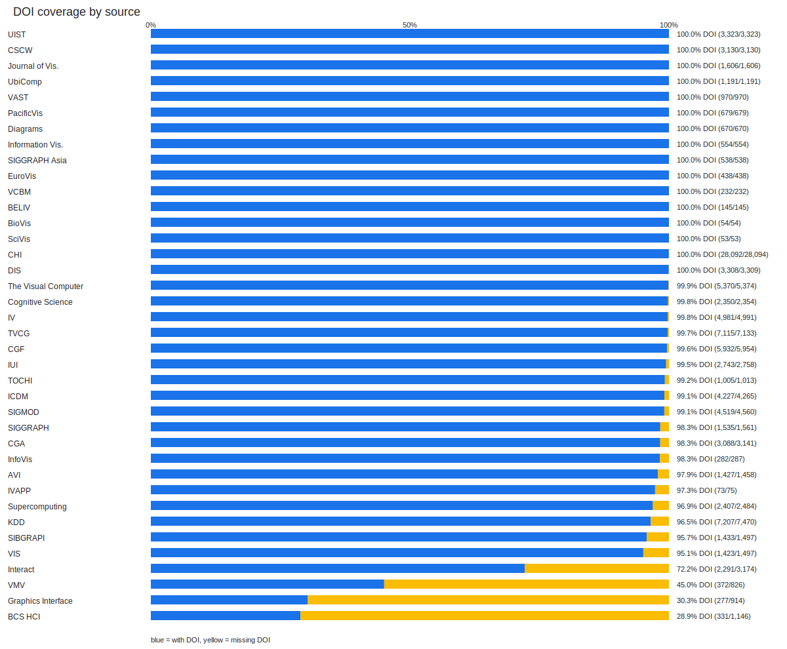

## Paper Completeness

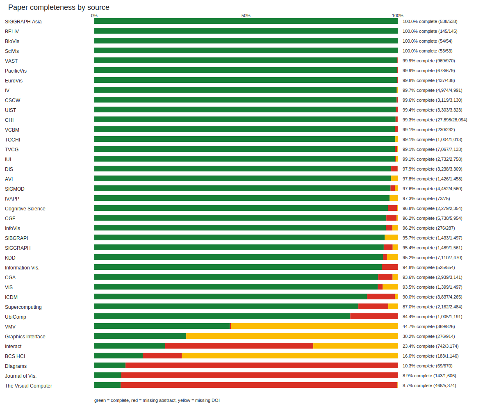

## Year Distribution

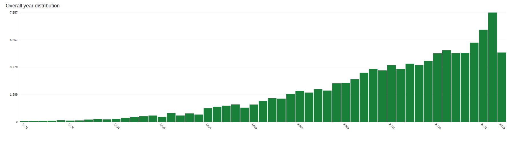

## Source Details

Machine-readable summary: [source_summary.csv](source_summary.csv)

| Source | Papers | DBLP sources | Complete | Missing abstract | Missing DOI | Year range |
|---|---:|---|---:|---:|---:|---|
| CHI | 28,094 | CHI (14,390) CHI Extended Abstracts (12,866) CHI Conference Companion (522) CHI 95 Conference Companion (237) CHI (2) (46) CHI (1) (33) | 27,898 (99.3%) | 194 (0.7%) | 2 (0.0%) | 1981-2026 |
| KDD | 7,470 | KDD (6,370) KDD (2) (594) KDD (1) (506) | 7,110 (95.2%) | 97 (1.3%) | 263 (3.5%) | 1995-2026 |
| TVCG | 7,133 | IEEE Trans. Vis. Comput. Graph. (7,133) | 7,067 (99.1%) | 48 (0.7%) | 18 (0.3%) | 1995-2026 |
| CGF | 5,954 | Comput. Graph. Forum (5,954) | 5,730 (96.2%) | 202 (3.4%) | 22 (0.4%) | 1982-2025 |
| The Visual Computer | 5,374 | Vis. Comput. (5,374) | 468 (8.7%) | 4,902 (91.2%) | 4 (0.1%) | 1985-2026 |
| IV | 4,991 | IV (4,890) IV (1) (71) IV (2) (30) | 4,974 (99.7%) | 7 (0.1%) | 10 (0.2%) | 1997-2025 |
| SIGMOD | 4,560 | SIGMOD Conference (4,560) | 4,452 (97.6%) | 67 (1.5%) | 41 (0.9%) | 1975-2022 |
| ICDM | 4,265 | ICDM (4,265) | 3,837 (90.0%) | 390 (9.1%) | 38 (0.9%) | 2001-2025 |
| UIST | 3,323 | UIST (1,882) UIST (Adjunct Volume) (1,006) ACM Symposium on User Interface Software and Technology (255) UIST Adjunct (180) | 3,303 (99.4%) | 20 (0.6%) | 0 (0.0%) | 1988-2025 |
| DIS | 3,309 | Conference on Designing Interactive Systems (1,995) Conference on Designing Interactive Systems (Companion Volume) (744) DIS (352) Symposium on Designing Interactive Systems (192) onference on Designing Interactive Systems (Companion Volume) (26) | 3,238 (97.9%) | 70 (2.1%) | 1 (0.0%) | 1995-2026 |
| Interact | 3,174 | INTERACT (1,009) INTERACT (4) (665) INTERACT (2) (576) INTERACT (1) (506) INTERACT (3) (337) INTERACT (5) (81) | 742 (23.4%) | 1,549 (48.8%) | 883 (27.8%) | 1990-2025 |
| CGA | 3,141 | IEEE Computer Graphics and Applications (3,141) | 2,939 (93.6%) | 149 (4.7%) | 53 (1.7%) | 1984-2026 |
| CSCW | 3,130 | CSCW (1,748) CSCW Companion (1,280) CSCW (Companion) (102) | 3,119 (99.6%) | 11 (0.4%) | 0 (0.0%) | 1986-2025 |
| IUI | 2,758 | IUI (2,022) IUI Companion (736) | 2,732 (99.1%) | 11 (0.4%) | 15 (0.5%) | 1993-2026 |
| Supercomputing | 2,484 | ICS (2,136) International Conference on Supercomputing (348) | 2,162 (87.0%) | 245 (9.9%) | 77 (3.1%) | 1987-2026 |
| Cognitive Science | 2,354 | Cogn. Sci. (2,354) | 2,279 (96.8%) | 71 (3.0%) | 4 (0.2%) | 1977-2025 |
| Journal of Vis. | 1,606 | J. Vis. (1,606) | 143 (8.9%) | 1,463 (91.1%) | 0 (0.0%) | 2003-2026 |
| SIGGRAPH | 1,561 | SIGGRAPH (1,561) | 1,489 (95.4%) | 46 (2.9%) | 26 (1.7%) | 1974-2003 |
| SIBGRAPI | 1,497 | SIBGRAPI (1,497) | 1,433 (95.7%) | 0 (0.0%) | 64 (4.3%) | 1998-2025 |
| VIS | 1,497 | IEEE Visualization (1,187) IEEE VIS (Short Papers) (244) IEEE VIS (66) | 1,399 (93.5%) | 24 (1.6%) | 74 (4.9%) | 1990-2024 |
| AVI | 1,458 | AVI (1,339) Advanced Visual Interfaces (119) | 1,426 (97.8%) | 1 (0.1%) | 31 (2.1%) | 1992-2026 |
| UbiComp | 1,191 | UbiComp (1,191) | 1,005 (84.4%) | 186 (15.6%) | 0 (0.0%) | 2001-2019 |
| BCS HCI | 1,146 | BCS HCI (948) BCS HCI (2) (156) BCS HCI (1) (42) | 183 (16.0%) | 148 (12.9%) | 815 (71.1%) | 1987-2017 |
| TOCHI | 1,013 | ACM Trans. Comput. Hum. Interact. (1,013) | 1,004 (99.1%) | 1 (0.1%) | 8 (0.8%) | 1994-2026 |
| VAST | 970 | IEEE VAST (482) VAST (423) VAST (Short and Project Papers) (55) IEEE VAST@IEEE VIS (10) | 969 (99.9%) | 1 (0.1%) | 0 (0.0%) | 2003-2020 |
| Graphics Interface | 914 | Graphics Interface (914) | 276 (30.2%) | 1 (0.1%) | 637 (69.7%) | 1996-2025 |
| VMV | 826 | VMV (826) | 369 (44.7%) | 3 (0.4%) | 454 (55.0%) | 2000-2024 |
| PacificVis | 679 | PacificVis (679) | 678 (99.9%) | 1 (0.1%) | 0 (0.0%) | 2008-2026 |
| Diagrams | 670 | Diagrams (670) | 69 (10.3%) | 601 (89.7%) | 0 (0.0%) | 2000-2024 |
| Information Vis. | 554 | Inf. Vis. (554) | 525 (94.8%) | 29 (5.2%) | 0 (0.0%) | 2002-2026 |
| SIGGRAPH Asia | 538 | SIGGRAPH Asia (538) | 538 (100.0%) | 0 (0.0%) | 0 (0.0%) | 2019-2025 |
| EuroVis | 438 | EuroVis (Short Papers) (293) EuroVis (116) EuroVis (STARs) (15) EuroVAST@EuroVis (14) | 437 (99.8%) | 1 (0.2%) | 0 (0.0%) | 2005-2024 |
| InfoVis | 287 | INFOVIS (287) | 276 (96.2%) | 6 (2.1%) | 5 (1.7%) | 1995-2005 |
| VCBM | 232 | VCBM (232) | 230 (99.1%) | 2 (0.9%) | 0 (0.0%) | 2008-2024 |
| BELIV | 145 | BELIV (145) | 145 (100.0%) | 0 (0.0%) | 0 (0.0%) | 2006-2024 |
| IVAPP | 75 | IVAPP (75) | 73 (97.3%) | 0 (0.0%) | 2 (2.7%) | 2014-2015 |
| BioVis | 54 | BioVis (54) | 54 (100.0%) | 0 (0.0%) | 0 (0.0%) | 2011-2013 |
| SciVis | 53 | SciVis (53) | 53 (100.0%) | 0 (0.0%) | 0 (0.0%) | 2015-2018 |

## Source Year Distributions

### CHI

- Papers: 28,094
- DBLP sources: CHI (14,390); CHI Extended Abstracts (12,866); CHI Conference Companion (522); CHI 95 Conference Companion (237); CHI (2) (46); CHI (1) (33)
- With DOI: 28,092 (100.0%)
- Missing DOI: 2 (0.0%)
- With abstract: 27,898 (99.3%)
- Missing abstract: 196 (0.7%)
- Complete: 27,898 (99.3%)
- With DOI but missing abstract: 194 (0.7%)
- Year range: 1981-2026

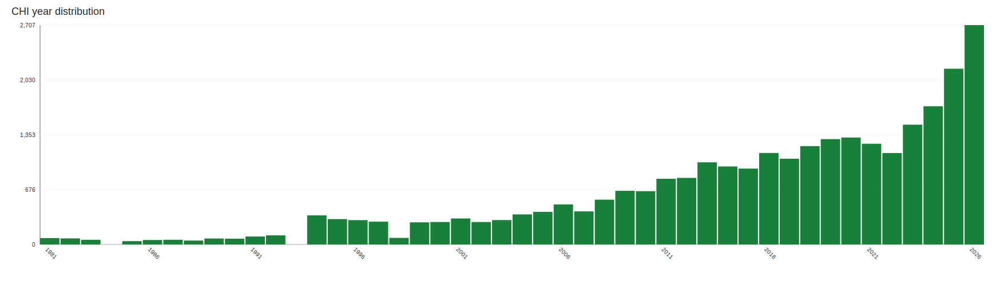

### KDD

- Papers: 7,470
- DBLP sources: KDD (6,370); KDD (2) (594); KDD (1) (506)
- With DOI: 7,207 (96.5%)
- Missing DOI: 263 (3.5%)
- With abstract: 7,110 (95.2%)
- Missing abstract: 360 (4.8%)
- Complete: 7,110 (95.2%)
- With DOI but missing abstract: 97 (1.3%)
- Year range: 1995-2026

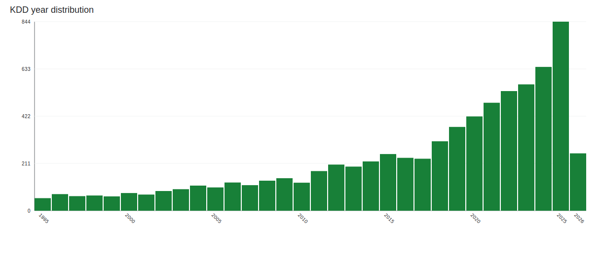

### TVCG

- Papers: 7,133
- DBLP sources: IEEE Trans. Vis. Comput. Graph. (7,133)
- With DOI: 7,115 (99.7%)
- Missing DOI: 18 (0.3%)
- With abstract: 7,067 (99.1%)
- Missing abstract: 66 (0.9%)
- Complete: 7,067 (99.1%)
- With DOI but missing abstract: 48 (0.7%)
- Year range: 1995-2026

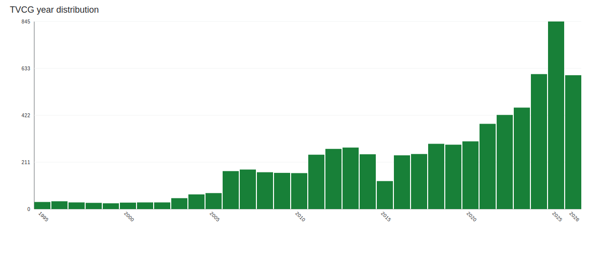

### CGF

- Papers: 5,954
- DBLP sources: Comput. Graph. Forum (5,954)
- With DOI: 5,932 (99.6%)
- Missing DOI: 22 (0.4%)
- With abstract: 5,730 (96.2%)
- Missing abstract: 224 (3.8%)
- Complete: 5,730 (96.2%)
- With DOI but missing abstract: 202 (3.4%)
- Year range: 1982-2025

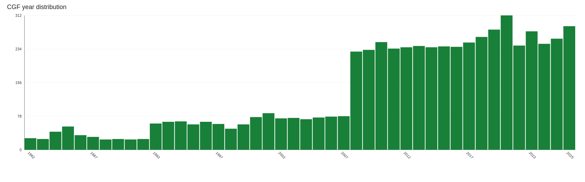

### The Visual Computer

- Papers: 5,374
- DBLP sources: Vis. Comput. (5,374)
- With DOI: 5,370 (99.9%)
- Missing DOI: 4 (0.1%)
- With abstract: 468 (8.7%)
- Missing abstract: 4,906 (91.3%)
- Complete: 468 (8.7%)
- With DOI but missing abstract: 4,902 (91.2%)
- Year range: 1985-2026

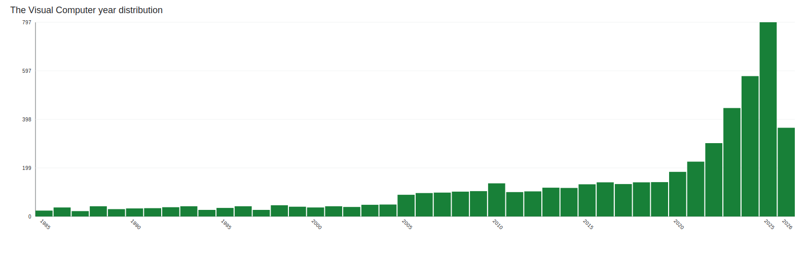

### IV

- Papers: 4,991
- DBLP sources: IV (4,890); IV (1) (71); IV (2) (30)
- With DOI: 4,981 (99.8%)
- Missing DOI: 10 (0.2%)
- With abstract: 4,974 (99.7%)
- Missing abstract: 17 (0.3%)
- Complete: 4,974 (99.7%)
- With DOI but missing abstract: 7 (0.1%)
- Year range: 1997-2025

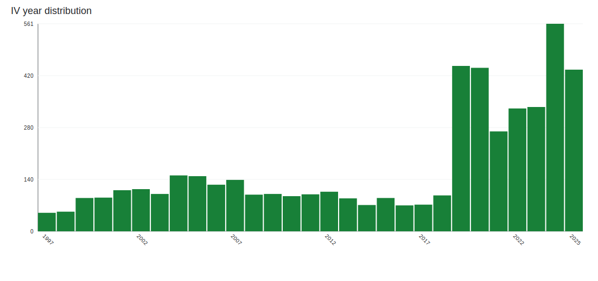

### SIGMOD

- Papers: 4,560
- DBLP sources: SIGMOD Conference (4,560)
- With DOI: 4,519 (99.1%)
- Missing DOI: 41 (0.9%)
- With abstract: 4,452 (97.6%)
- Missing abstract: 108 (2.4%)
- Complete: 4,452 (97.6%)
- With DOI but missing abstract: 67 (1.5%)
- Year range: 1975-2022

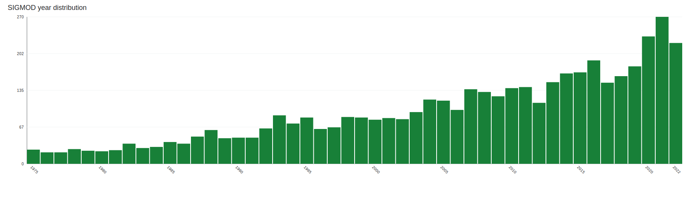

### ICDM

- Papers: 4,265
- DBLP sources: ICDM (4,265)
- With DOI: 4,227 (99.1%)
- Missing DOI: 38 (0.9%)
- With abstract: 3,837 (90.0%)
- Missing abstract: 428 (10.0%)
- Complete: 3,837 (90.0%)
- With DOI but missing abstract: 390 (9.1%)
- Year range: 2001-2025

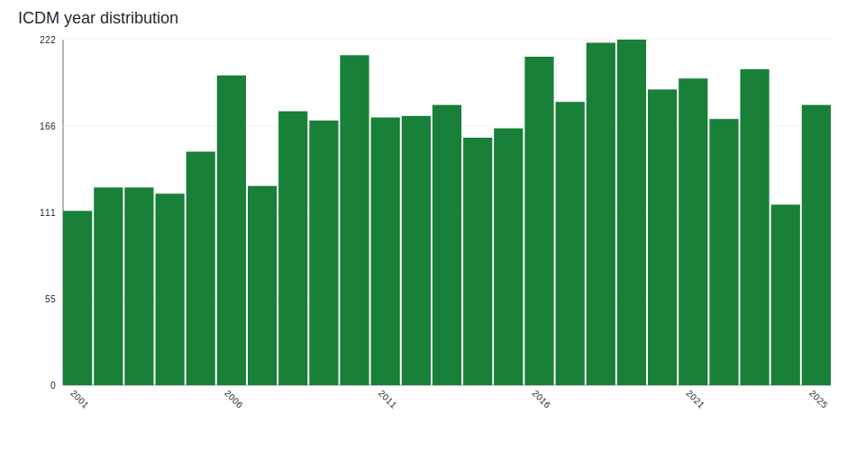

### UIST

- Papers: 3,323
- DBLP sources: UIST (1,882); UIST (Adjunct Volume) (1,006); ACM Symposium on User Interface Software and Technology (255); UIST Adjunct (180)
- With DOI: 3,323 (100.0%)
- Missing DOI: 0 (0.0%)
- With abstract: 3,303 (99.4%)
- Missing abstract: 20 (0.6%)
- Complete: 3,303 (99.4%)
- With DOI but missing abstract: 20 (0.6%)
- Year range: 1988-2025

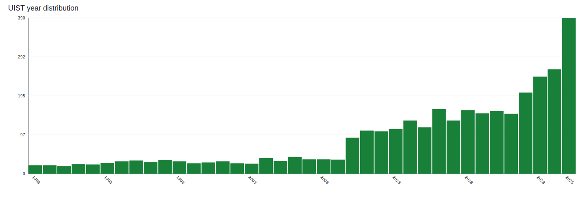

### DIS

- Papers: 3,309
- DBLP sources: Conference on Designing Interactive Systems (1,995); Conference on Designing Interactive Systems (Companion Volume) (744); DIS (352); Symposium on Designing Interactive Systems (192); onference on Designing Interactive Systems (Companion Volume) (26)
- With DOI: 3,308 (100.0%)
- Missing DOI: 1 (0.0%)
- With abstract: 3,238 (97.9%)
- Missing abstract: 71 (2.1%)
- Complete: 3,238 (97.9%)
- With DOI but missing abstract: 70 (2.1%)
- Year range: 1995-2026

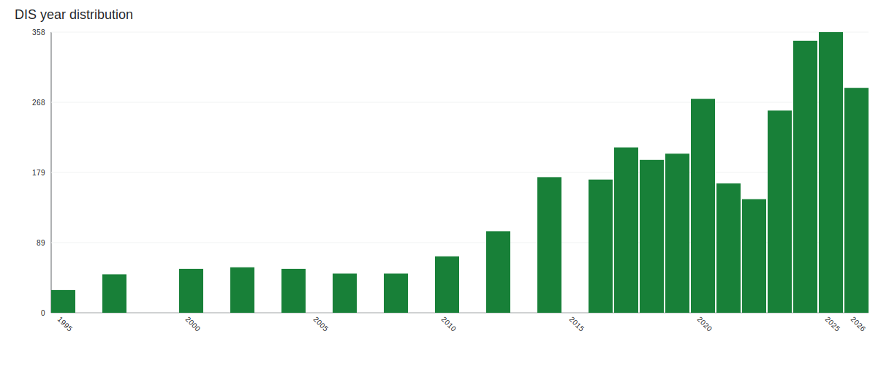

### Interact

- Papers: 3,174
- DBLP sources: INTERACT (1,009); INTERACT (4) (665); INTERACT (2) (576); INTERACT (1) (506); INTERACT (3) (337); INTERACT (5) (81)
- With DOI: 2,291 (72.2%)
- Missing DOI: 883 (27.8%)
- With abstract: 742 (23.4%)
- Missing abstract: 2,432 (76.6%)
- Complete: 742 (23.4%)
- With DOI but missing abstract: 1,549 (48.8%)
- Year range: 1990-2025

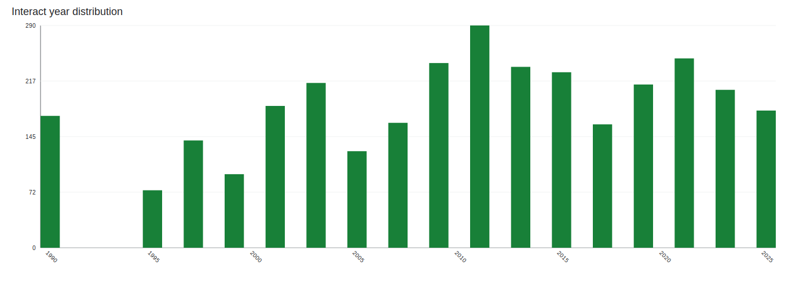

### CGA

- Papers: 3,141
- DBLP sources: IEEE Computer Graphics and Applications (3,141)
- With DOI: 3,088 (98.3%)
- Missing DOI: 53 (1.7%)
- With abstract: 2,939 (93.6%)
- Missing abstract: 202 (6.4%)
- Complete: 2,939 (93.6%)
- With DOI but missing abstract: 149 (4.7%)
- Year range: 1984-2026

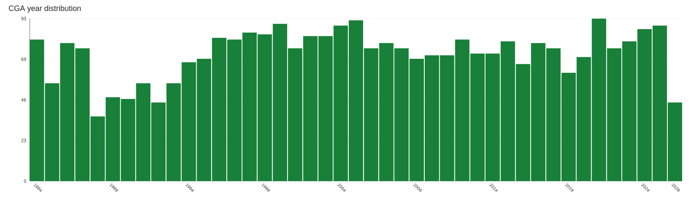

### CSCW

- Papers: 3,130
- DBLP sources: CSCW (1,748); CSCW Companion (1,280); CSCW (Companion) (102)
- With DOI: 3,130 (100.0%)
- Missing DOI: 0 (0.0%)
- With abstract: 3,119 (99.6%)
- Missing abstract: 11 (0.4%)
- Complete: 3,119 (99.6%)
- With DOI but missing abstract: 11 (0.4%)
- Year range: 1986-2025

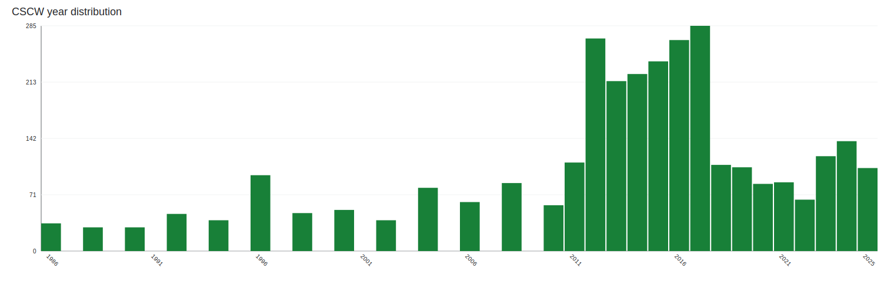

### IUI

- Papers: 2,758
- DBLP sources: IUI (2,022); IUI Companion (736)
- With DOI: 2,743 (99.5%)
- Missing DOI: 15 (0.5%)
- With abstract: 2,732 (99.1%)
- Missing abstract: 26 (0.9%)
- Complete: 2,732 (99.1%)
- With DOI but missing abstract: 11 (0.4%)
- Year range: 1993-2026

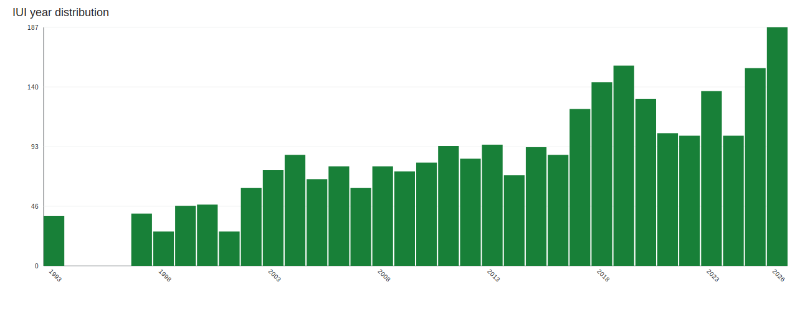

### Supercomputing

- Papers: 2,484
- DBLP sources: ICS (2,136); International Conference on Supercomputing (348)
- With DOI: 2,407 (96.9%)
- Missing DOI: 77 (3.1%)
- With abstract: 2,162 (87.0%)
- Missing abstract: 322 (13.0%)
- Complete: 2,162 (87.0%)
- With DOI but missing abstract: 245 (9.9%)
- Year range: 1987-2026

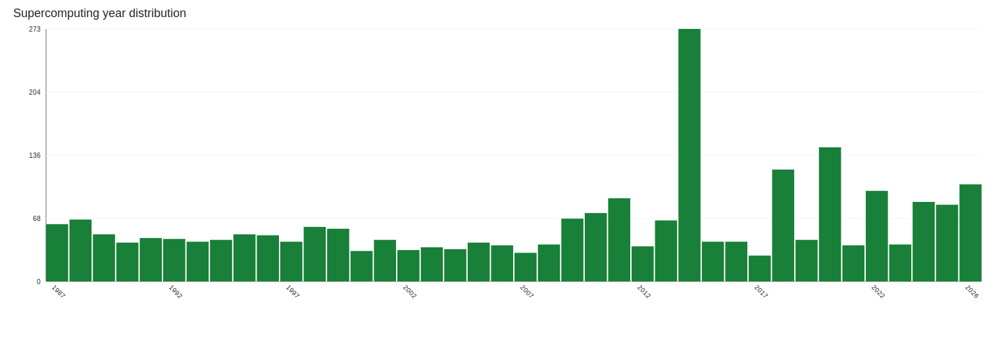

### Cognitive Science

- Papers: 2,354
- DBLP sources: Cogn. Sci. (2,354)
- With DOI: 2,350 (99.8%)
- Missing DOI: 4 (0.2%)
- With abstract: 2,279 (96.8%)
- Missing abstract: 75 (3.2%)
- Complete: 2,279 (96.8%)
- With DOI but missing abstract: 71 (3.0%)
- Year range: 1977-2025

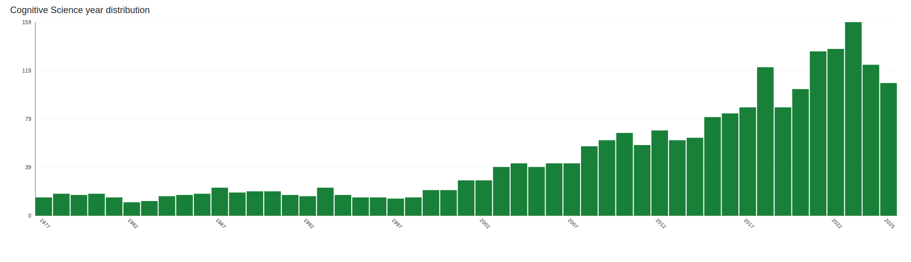

### Journal of Vis.

- Papers: 1,606
- DBLP sources: J. Vis. (1,606)
- With DOI: 1,606 (100.0%)
- Missing DOI: 0 (0.0%)
- With abstract: 143 (8.9%)
- Missing abstract: 1,463 (91.1%)
- Complete: 143 (8.9%)
- With DOI but missing abstract: 1,463 (91.1%)
- Year range: 2003-2026

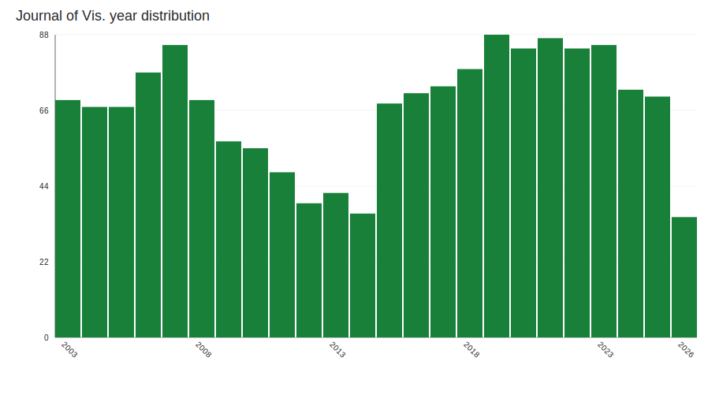

### SIGGRAPH

- Papers: 1,561
- DBLP sources: SIGGRAPH (1,561)
- With DOI: 1,535 (98.3%)
- Missing DOI: 26 (1.7%)
- With abstract: 1,489 (95.4%)
- Missing abstract: 72 (4.6%)
- Complete: 1,489 (95.4%)
- With DOI but missing abstract: 46 (2.9%)
- Year range: 1974-2003

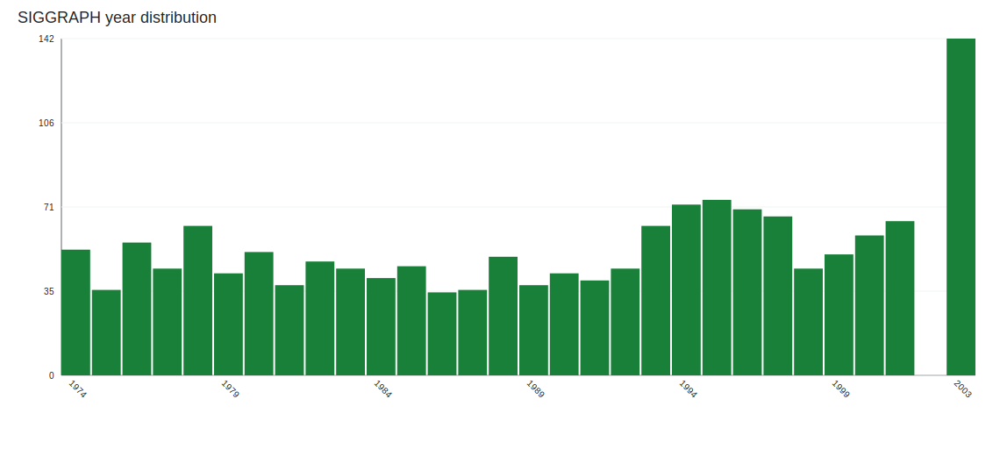

### SIBGRAPI

- Papers: 1,497
- DBLP sources: SIBGRAPI (1,497)
- With DOI: 1,433 (95.7%)
- Missing DOI: 64 (4.3%)
- With abstract: 1,433 (95.7%)
- Missing abstract: 64 (4.3%)
- Complete: 1,433 (95.7%)
- With DOI but missing abstract: 0 (0.0%)
- Year range: 1998-2025

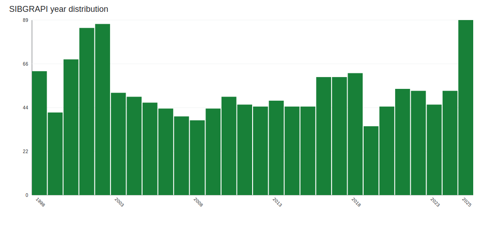

### VIS

- Papers: 1,497
- DBLP sources: IEEE Visualization (1,187); IEEE VIS (Short Papers) (244); IEEE VIS (66)
- With DOI: 1,423 (95.1%)
- Missing DOI: 74 (4.9%)
- With abstract: 1,399 (93.5%)
- Missing abstract: 98 (6.5%)
- Complete: 1,399 (93.5%)
- With DOI but missing abstract: 24 (1.6%)
- Year range: 1990-2024

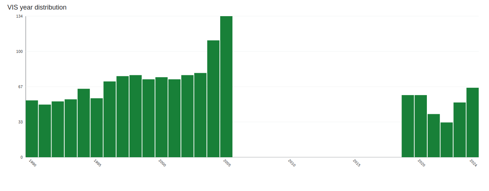

### AVI

- Papers: 1,458
- DBLP sources: AVI (1,339); Advanced Visual Interfaces (119)
- With DOI: 1,427 (97.9%)
- Missing DOI: 31 (2.1%)
- With abstract: 1,426 (97.8%)
- Missing abstract: 32 (2.2%)
- Complete: 1,426 (97.8%)
- With DOI but missing abstract: 1 (0.1%)
- Year range: 1992-2026

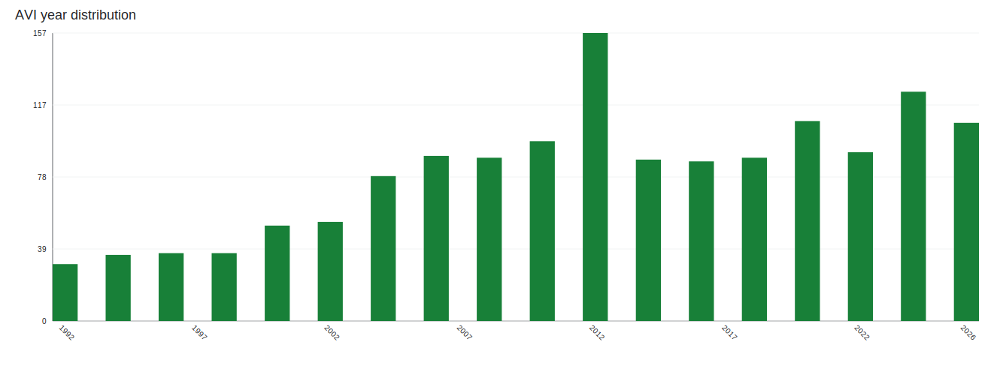

### UbiComp

- Papers: 1,191
- DBLP sources: UbiComp (1,191)
- With DOI: 1,191 (100.0%)
- Missing DOI: 0 (0.0%)
- With abstract: 1,005 (84.4%)
- Missing abstract: 186 (15.6%)
- Complete: 1,005 (84.4%)
- With DOI but missing abstract: 186 (15.6%)
- Year range: 2001-2019

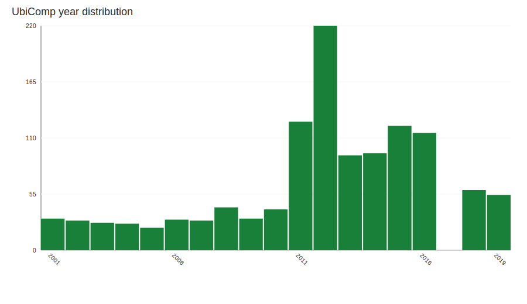

### BCS HCI

- Papers: 1,146
- DBLP sources: BCS HCI (948); BCS HCI (2) (156); BCS HCI (1) (42)
- With DOI: 331 (28.9%)
- Missing DOI: 815 (71.1%)
- With abstract: 183 (16.0%)
- Missing abstract: 963 (84.0%)
- Complete: 183 (16.0%)
- With DOI but missing abstract: 148 (12.9%)
- Year range: 1987-2017

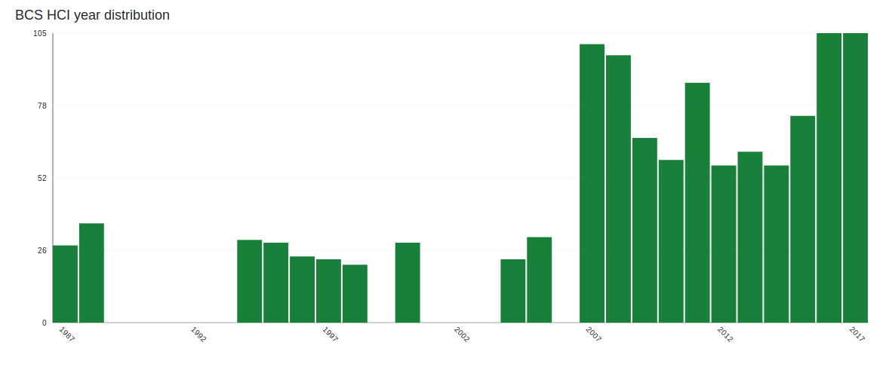

### TOCHI

- Papers: 1,013
- DBLP sources: ACM Trans. Comput. Hum. Interact. (1,013)
- With DOI: 1,005 (99.2%)
- Missing DOI: 8 (0.8%)
- With abstract: 1,004 (99.1%)
- Missing abstract: 9 (0.9%)
- Complete: 1,004 (99.1%)
- With DOI but missing abstract: 1 (0.1%)
- Year range: 1994-2026

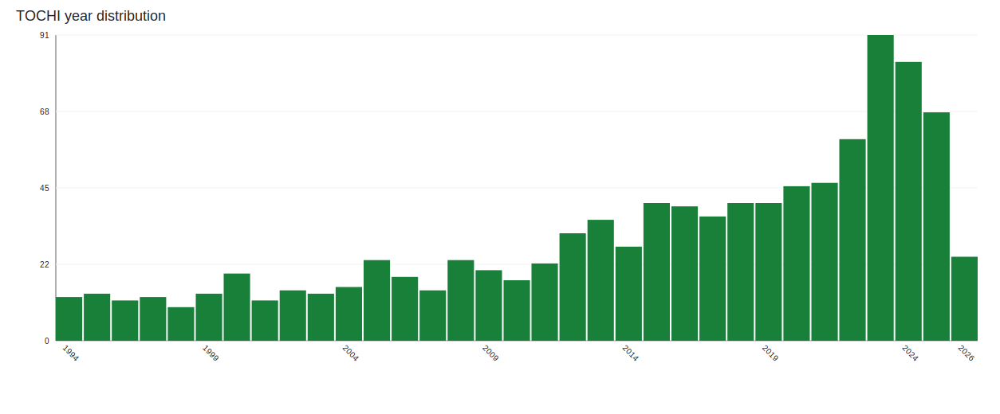

### VAST

- Papers: 970
- DBLP sources: IEEE VAST (482); VAST (423); VAST (Short and Project Papers) (55); IEEE VAST@IEEE VIS (10)
- With DOI: 970 (100.0%)
- Missing DOI: 0 (0.0%)
- With abstract: 969 (99.9%)
- Missing abstract: 1 (0.1%)
- Complete: 969 (99.9%)
- With DOI but missing abstract: 1 (0.1%)
- Year range: 2003-2020

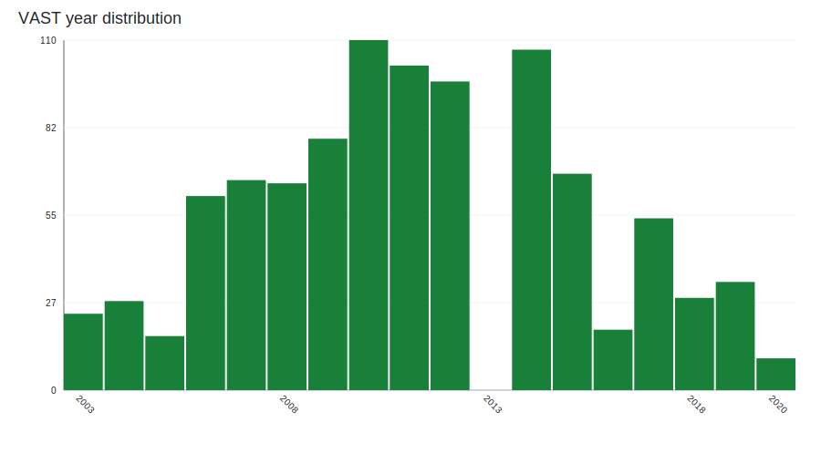

### Graphics Interface

- Papers: 914
- DBLP sources: Graphics Interface (914)
- With DOI: 277 (30.3%)
- Missing DOI: 637 (69.7%)
- With abstract: 276 (30.2%)
- Missing abstract: 638 (69.8%)
- Complete: 276 (30.2%)
- With DOI but missing abstract: 1 (0.1%)
- Year range: 1996-2025

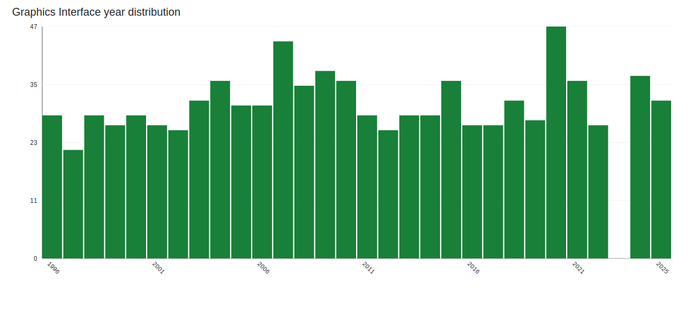

### VMV

- Papers: 826
- DBLP sources: VMV (826)
- With DOI: 372 (45.0%)
- Missing DOI: 454 (55.0%)
- With abstract: 369 (44.7%)
- Missing abstract: 457 (55.3%)
- Complete: 369 (44.7%)
- With DOI but missing abstract: 3 (0.4%)
- Year range: 2000-2024

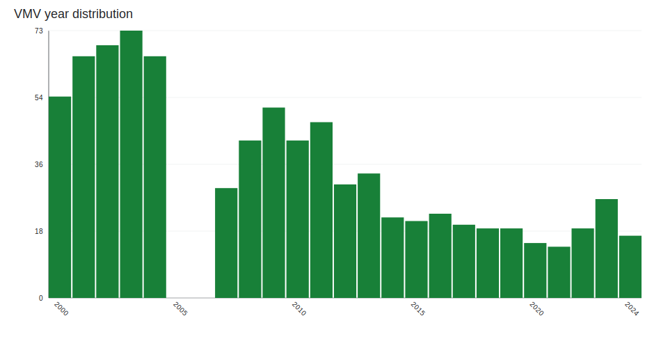

### PacificVis

- Papers: 679
- DBLP sources: PacificVis (679)
- With DOI: 679 (100.0%)
- Missing DOI: 0 (0.0%)
- With abstract: 678 (99.9%)
- Missing abstract: 1 (0.1%)
- Complete: 678 (99.9%)
- With DOI but missing abstract: 1 (0.1%)
- Year range: 2008-2026

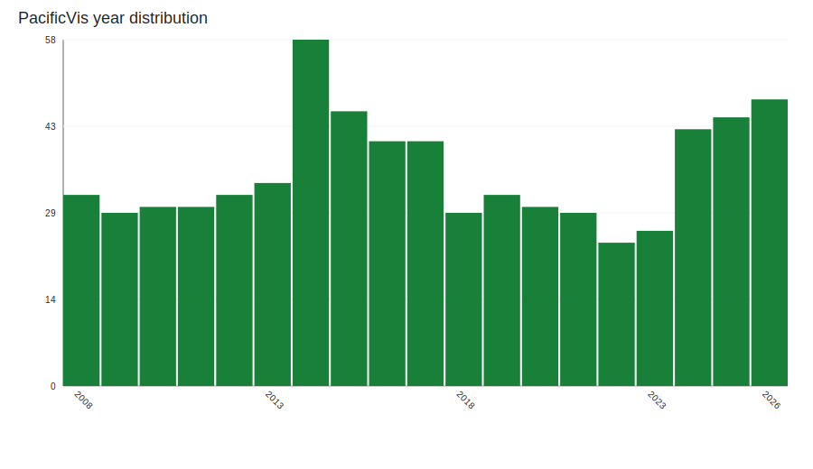

### Diagrams

- Papers: 670
- DBLP sources: Diagrams (670)
- With DOI: 670 (100.0%)
- Missing DOI: 0 (0.0%)
- With abstract: 69 (10.3%)
- Missing abstract: 601 (89.7%)
- Complete: 69 (10.3%)
- With DOI but missing abstract: 601 (89.7%)
- Year range: 2000-2024

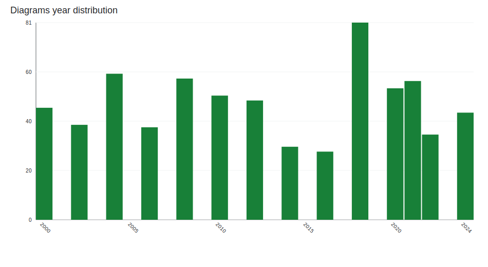

### Information Vis.

- Papers: 554
- DBLP sources: Inf. Vis. (554)
- With DOI: 554 (100.0%)
- Missing DOI: 0 (0.0%)
- With abstract: 525 (94.8%)
- Missing abstract: 29 (5.2%)
- Complete: 525 (94.8%)
- With DOI but missing abstract: 29 (5.2%)
- Year range: 2002-2026

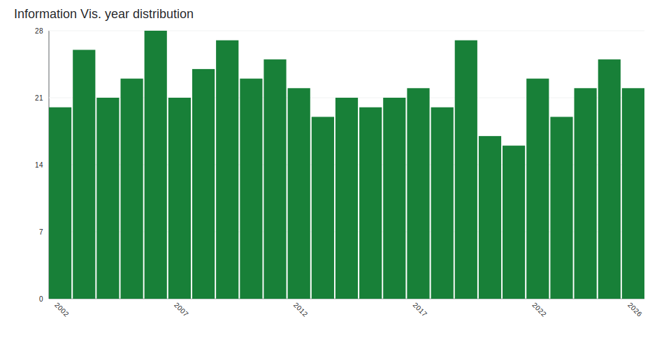

### SIGGRAPH Asia

- Papers: 538
- DBLP sources: SIGGRAPH Asia (538)
- With DOI: 538 (100.0%)
- Missing DOI: 0 (0.0%)
- With abstract: 538 (100.0%)
- Missing abstract: 0 (0.0%)
- Complete: 538 (100.0%)
- With DOI but missing abstract: 0 (0.0%)
- Year range: 2019-2025

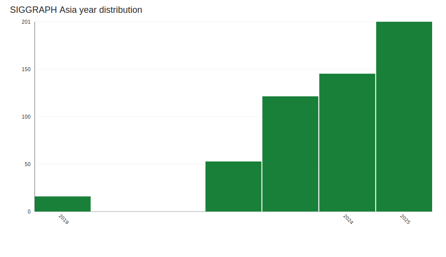

### EuroVis

- Papers: 438
- DBLP sources: EuroVis (Short Papers) (293); EuroVis (116); EuroVis (STARs) (15); EuroVAST@EuroVis (14)
- With DOI: 438 (100.0%)
- Missing DOI: 0 (0.0%)
- With abstract: 437 (99.8%)
- Missing abstract: 1 (0.2%)
- Complete: 437 (99.8%)
- With DOI but missing abstract: 1 (0.2%)
- Year range: 2005-2024

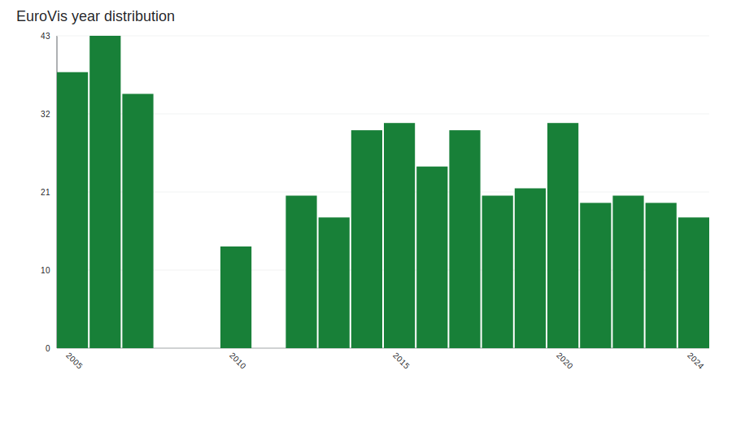

### InfoVis

- Papers: 287
- DBLP sources: INFOVIS (287)
- With DOI: 282 (98.3%)
- Missing DOI: 5 (1.7%)
- With abstract: 276 (96.2%)
- Missing abstract: 11 (3.8%)
- Complete: 276 (96.2%)
- With DOI but missing abstract: 6 (2.1%)
- Year range: 1995-2005

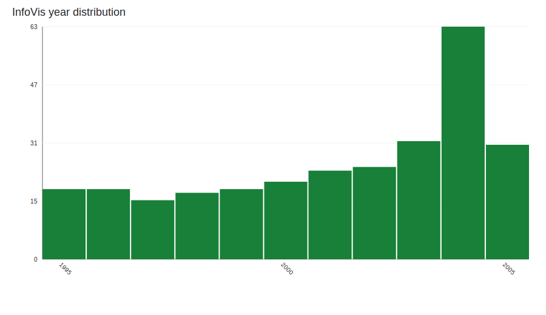

### VCBM

- Papers: 232
- DBLP sources: VCBM (232)
- With DOI: 232 (100.0%)
- Missing DOI: 0 (0.0%)
- With abstract: 230 (99.1%)
- Missing abstract: 2 (0.9%)
- Complete: 230 (99.1%)
- With DOI but missing abstract: 2 (0.9%)
- Year range: 2008-2024

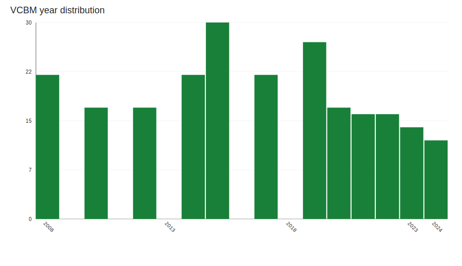

### BELIV

- Papers: 145
- DBLP sources: BELIV (145)
- With DOI: 145 (100.0%)
- Missing DOI: 0 (0.0%)
- With abstract: 145 (100.0%)
- Missing abstract: 0 (0.0%)
- Complete: 145 (100.0%)
- With DOI but missing abstract: 0 (0.0%)
- Year range: 2006-2024

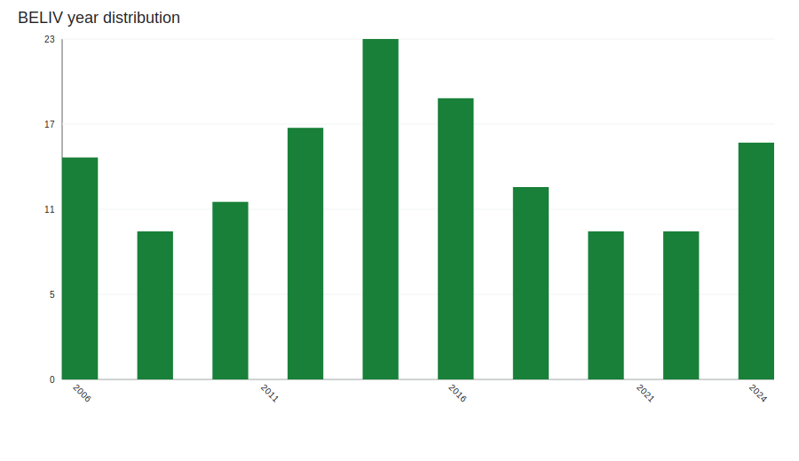

### IVAPP

- Papers: 75
- DBLP sources: IVAPP (75)
- With DOI: 73 (97.3%)
- Missing DOI: 2 (2.7%)
- With abstract: 73 (97.3%)
- Missing abstract: 2 (2.7%)
- Complete: 73 (97.3%)
- With DOI but missing abstract: 0 (0.0%)
- Year range: 2014-2015

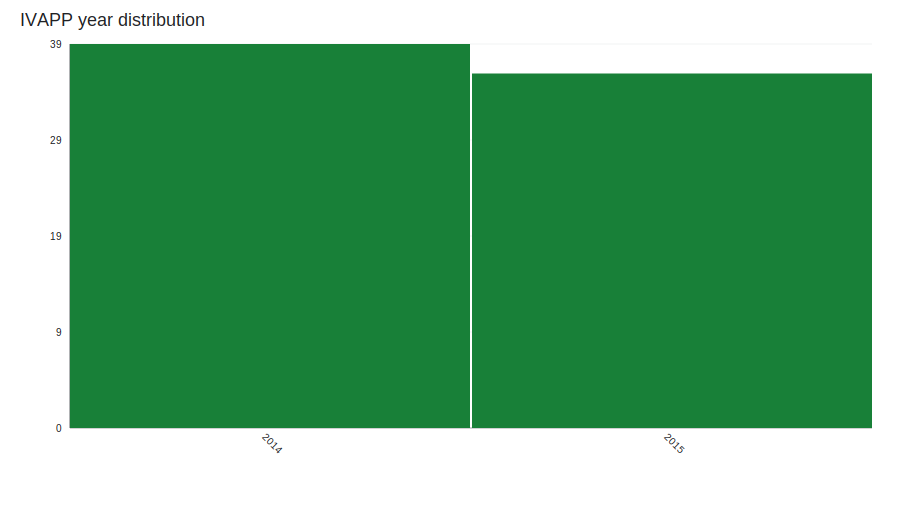

### BioVis

- Papers: 54
- DBLP sources: BioVis (54)
- With DOI: 54 (100.0%)
- Missing DOI: 0 (0.0%)
- With abstract: 54 (100.0%)
- Missing abstract: 0 (0.0%)
- Complete: 54 (100.0%)
- With DOI but missing abstract: 0 (0.0%)
- Year range: 2011-2013

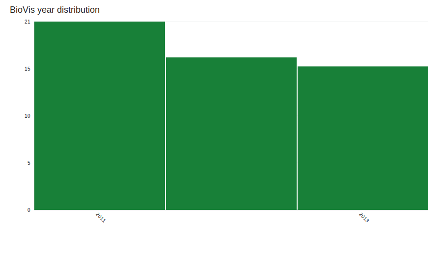

### SciVis

- Papers: 53
- DBLP sources: SciVis (53)
- With DOI: 53 (100.0%)
- Missing DOI: 0 (0.0%)
- With abstract: 53 (100.0%)
- Missing abstract: 0 (0.0%)
- Complete: 53 (100.0%)
- With DOI but missing abstract: 0 (0.0%)
- Year range: 2015-2018

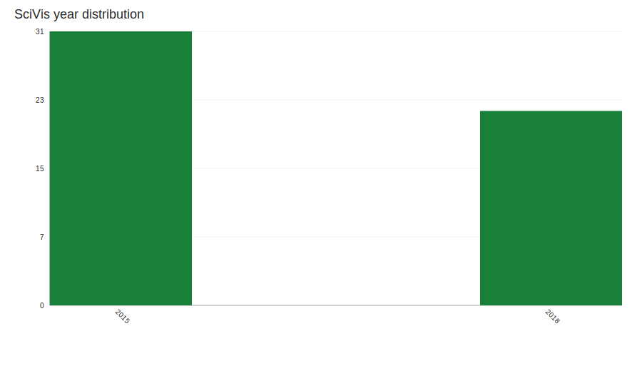

